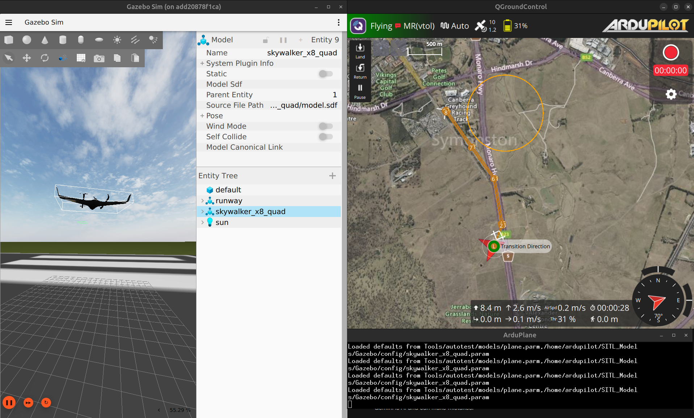

# tiltrotor-sim-to-real
A modular simulation and development environment for a tiltrotor VTOL UAV, integrating ArduPilot SITL, Gazebo Harmony and ROS 2. This project aims to bridge the gap between simulation and real-world deployment, starting from a simulation-first approach for control development and system validation.

## 🚀 System Overview

*Full-stack integration featuring QGroundControl, ArduPilot SITL, and Gazebo running in a unified Docker environment.*

## 🛠️ Key Features
*   **Dockerized Workflow:** Entire environment (GCS, Flight Stack, Physics Engine) launches via `docker-compose`.
*   **VTOL Logic:** Custom mission planning with `MAVLINK Protocol`.
*   **Sim-to-Real Pipeline:** Validating control laws in Gazebo before hardware-in-the-loop (HIL) testing.
*   **Modular Architecture:** Easily swap UAV models or flight controllers.

## 🏃 Quick Start
Ensure you have Docker and the NVIDIA Container Toolkit installed

Launch or Build container:
```bash
cd docker
docker-compose up -d
```

Use container as interactive mode:
```bash
 docker exec -it ardupilot-sitl bash
```
#### Run Gazebo

```bash
gz sim -v4 -r skywalker_x8_quad_runway.sdf
```

#### Run ArduPilot SITL

```bash
sim_vehicle.py -v ArduPlane --model JSON --add-param-file=$HOME/SITL_Models/Gazebo/config/skywalker_x8_quad.param --console --map
```

#### Run Qgroundcontrol

```bash
qgroundcontrol
```